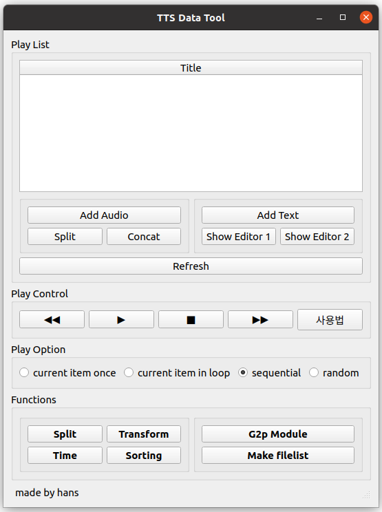
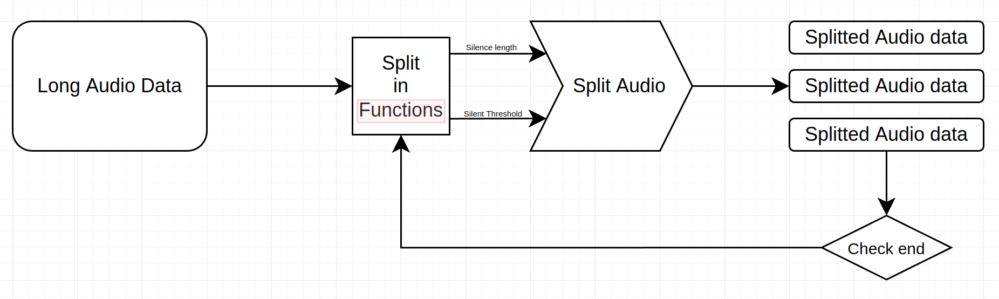
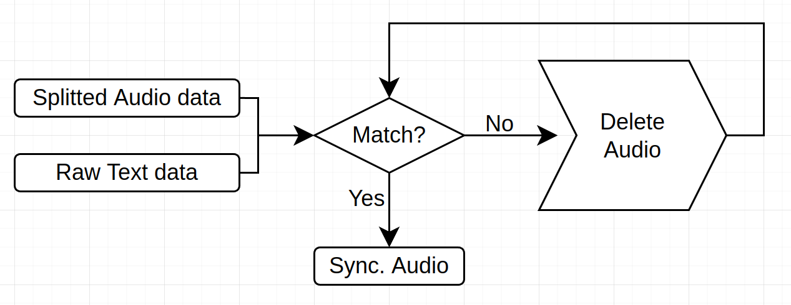
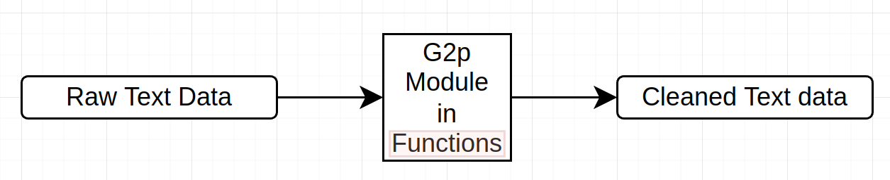
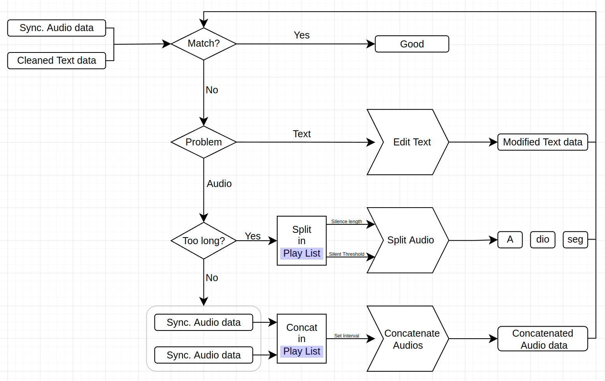

## 오디오 데이터 작업 툴



### Preparations
- **Clone this repo and install requirements**
    ```bash
    git clone https://github.com/AIPARK-TTS/Data_Tool.git
    cd Audio_Tool
    pip install -r requirements.txt
    ```

### Usage
- **Run main.py**
    ```bash
    python main.py
    ```
- **Flow charts**
    - Split long audio data
        
    - Synchronize with Raw text
        
    - G2p Raw text data
        
    - Acceptance process
        
- **Read docs**
    https://www.notion.so/aipark/TTS-Data-Tool-7cff8ed2a0e74e11ad3a4f0bb254b498?pvs=4


## Reference
[1] [PyQt5](https://doc.qt.io/qtforpython/)
